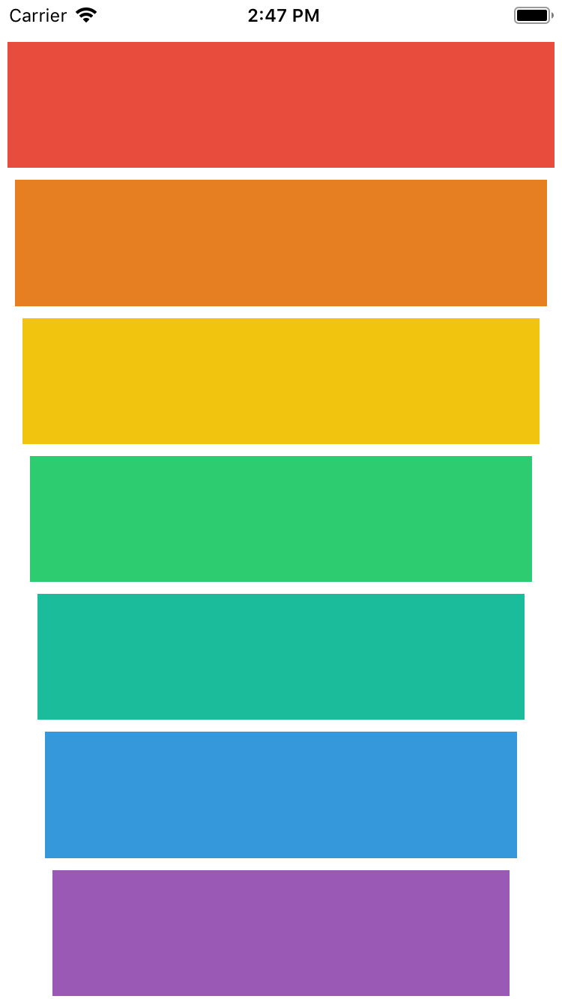

# XylophoneApp
Simple xylophone simulator app

Technologies: 
  * XCode Storyboard
  * UIButton
  * Buttons properties (colors, tags)
  * AVFoundation Kit
  * Swift arrays, functions, lets, vars, scopes
  * Playing sound on iOS using swift
